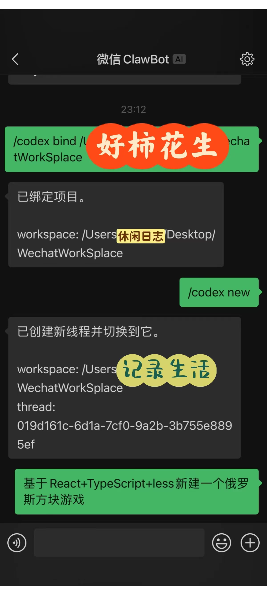
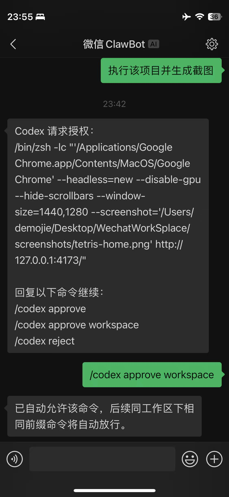
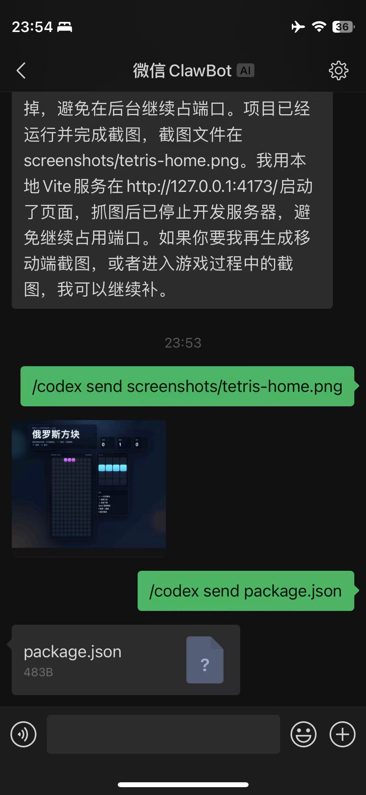

# 使用方法：
## 安装：
```
git clone https://github.com/demoadminjie/codex-wechat.git
cd codex-wechat
npm install
```

## 绑定微信：
```
npm run login
```
终端会打印二维码。扫码确认后，会把账号信息保存在：
```
~/.codex-wechat/accounts/<account-id>.json
```

## 启动
```bash
npm run start
```

或：

```bash
node ./bin/codex-wechat.js start
```

## 使用示例：
1. 绑定工作目录（也可以在`.env`中配置）

    `/codex bind <绝对路径>`

2. 建立新会话

    `/codex new`

3. 命令codex建立项目

    `基于React+TypeScript+Less生成一个俄罗斯方块游戏`



4. 生成截图验证项目效果（等待codex返回项目完成的消息后）

    `执行项目并生成截图`



5. 手机上查看截图（等待codex返回生成的截图信息后）

    `/codex send screenshots/tetris-home.png`


